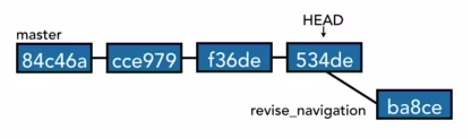
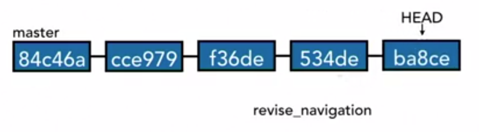
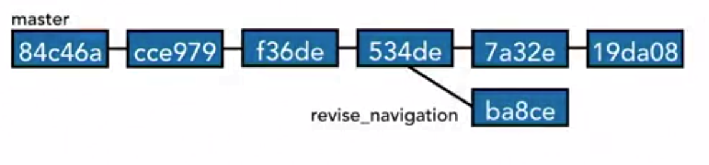
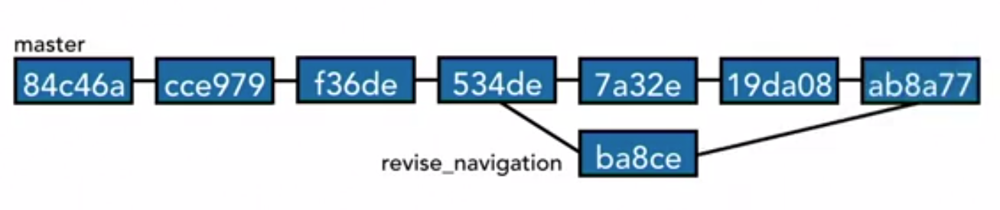
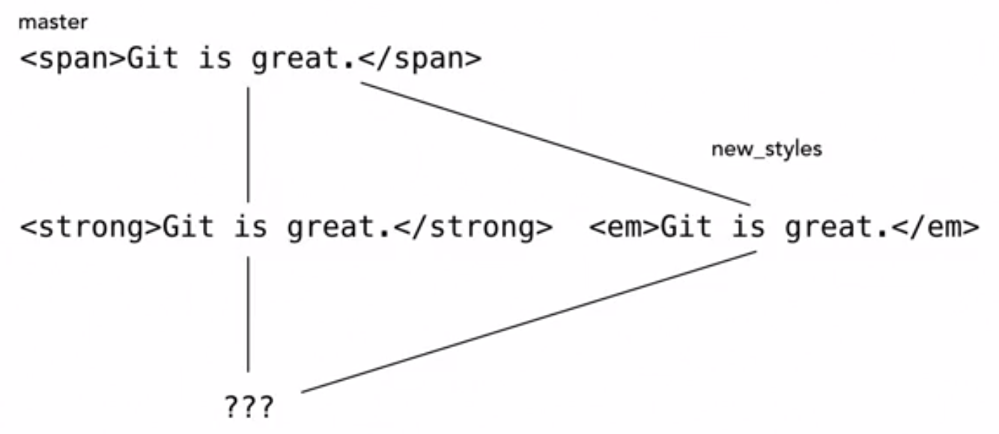

# Merge Branches

## Merge code

Be on the branch you want to merge to.
1. Ex : `git checkout master`
2. `git merge <branch-name>`
3. Verify  using `git branch --merged`

## Fast forward merge vs true merge

 Fast forward merge

 When there are no additional commits on the master branch since the new branch was created, then merging the new branch to master branch will be a Fast forward merge.

True merge

When there are additional commits on the master branch and since the branch happened. Then merging the branch to the master branch is a true merge.

## Merge Conflicts

Merge conflicts occur when there is change to same line in 2 different commits.

