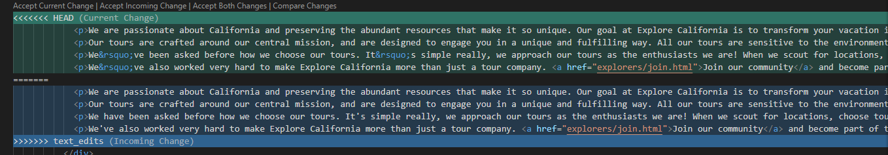
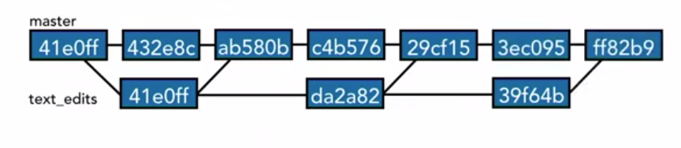
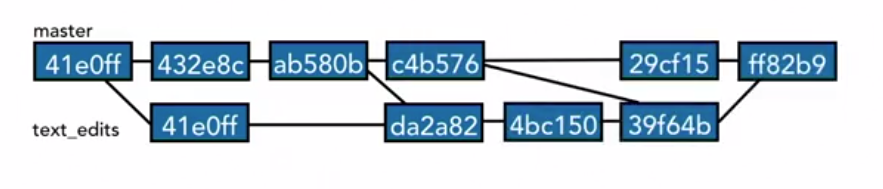

# Merge Branches

## Merge code

Be on the branch you want to merge to.
1. Ex : `git checkout master`
2. `git merge <branch-name>`
3. Verify  using `git branch --merged`

## Fast forward merge vs true merge

 Fast forward merge

 When there are no additional commits on the master branch since the new branch was created, then merging the new branch to master branch will be a Fast forward merge.


True merge

When there are additional commits on the master branch and since the branch happened. Then merging the branch to the master branch is a true merge.


## Merge Conflicts

Merge conflicts occur when there is change to same line in 2 different commits.


Example:

Let us create a conflict in file mission.html.

1. Create a new branch `git checkout -b text_edits`
2. Make changes to some lines in mission.html file and remember the lines. Commit the changes.
```
>> git checkout -b text_edits
Switched to a new branch 'text_edits'

>> git status
On branch text_edits
Changes not staged for commit:
  (use "git add <file>..." to update what will be committed)
  (use "git checkout -- <file>..." to discard changes in working directory)

        modified:   4_explore_california/mission.html

no changes added to commit (use "git add" and/or "git commit -a")

>> git commit -am "Text edits to mission page"
[text_edits af6890c] Text edits to mission page
 1 file changed, 3 insertions(+), 3 deletions(-)
```
3. Going back to the master branch `git checkout master`. All the edits made in text_edits branch will not be visible here .
4. Make edits to the same lines in mission.html as in point 3 and commit.

```
>> git checkout master
Switched to branch 'master'
Your branch is ahead of 'origin/master' by 1 commit.
  (use "git push" to publish your local commits)

>> git status
On branch master
Your branch is ahead of 'origin/master' by 1 commit.
  (use "git push" to publish your local commits)

Changes not staged for commit:
  (use "git add <file>..." to update what will be committed)
  (use "git checkout -- <file>..." to discard changes in working directory)

        modified:   4_explore_california/mission.html

no changes added to commit (use "git add" and/or "git commit -a")

>> git commit -am "Repalces straight quotes with curly quotes"
[master aca2809] Repalces straight quotes with curly quotes
 1 file changed, 3 insertions(+), 3 deletions(-)
```

5. Being on the master branch lets merge the text-edits to master branch. `git merge text_edits`. Here we can see git gives CONFLICT content message.

```
>> git merge text_edits
Auto-merging 4_explore_california/mission.html
CONFLICT (content): Merge conflict in 4_explore_california/mission.html
Automatic merge failed; fix conflicts and then commit the result.

>> git status
On branch master
You have unmerged paths.
  (fix conflicts and run "git commit")
  (use "git merge --abort" to abort the merge)

Unmerged paths:
  (use "git add <file>..." to mark resolution)

        both modified:   4_explore_california/mission.html

no changes added to commit (use "git add" and/or "git commit -a")

```
6. Now Opening the Mission.html file, it shows the conflicts highlighted as below with git markers :  `<<<<<<<` (current changes in green), `>>>>>>>`(incoming changes in blue) and `=======` (seperator).

    

## Resolve merge conflicts

There are 3 ways in which the merge conflicts can be resolved.
- Abort merge : `git merge --abort` this will go back to the master branch .
- Resolve the conflicts manually
  
  Go through the differences (`git diff --color-words master..text_edits`) between the 2 files and discard the one that you dont want and keep the necessary stuff in the mission.html file and save the file. Along with the texts, also remove the git markers  `<<<<<<<` (current changes),`>>>>>>>`(incoming changes) and `=======` (seperator)

  Then we can add the file to staging index. git status now says we have fixed conflicts but still in the process of merging. We can not type just `git commit` a text editor will open asking to fill the commit message.

```
> git status
On branch master
Your branch is ahead of 'origin/master' by 2 commits.
  (use "git push" to publish your local commits)

You have unmerged paths.
  (fix conflicts and run "git commit")
  (use "git merge --abort" to abort the merge)

Unmerged paths:
  (use "git add <file>..." to mark resolution)

        both modified:   4_explore_california/mission.html

no changes added to commit (use "git add" and/or "git commit -a")

>> git add .\4_explore_california\mission.html

>> git status
On branch master
All conflicts fixed but you are still merging.
  (use "git commit" to conclude merge)
```

  We can visuailise the commit and the merging with  `git log --oneline --graph --all --decorate`. Here we can see that the text_edits branch merges with the master branch.
```
>> git log --oneline --graph --all --decorate
*   13f85a5 (HEAD -> master) Merge branch 'text_edits'
|\
| * af6890c (text_edits) Text edits to mission page
* | aca2809 Repalces straight quotes with curly quotes
|/
* 9ab15a2 Merge Branches, True Merge, Fast forward merge
* 6779bfd (origin/master) git reset
* 525bfd3 Branching in git
| * 4b17b69 (reset_branch) some edits to explorers file
| * 8dd744c some edits to index file
| * ec7f08e Commit AB
| * b4a71f8 (shorten_the_text) Readme updated with branch compare
| * 61f31d9 Changed the text by adding 'repo' at the end
| * f796556 Shortened the text
| * 36e6994 (test_git_branch) Add file to new_feature branch
|/
* aca2cde commit before creating new_feature branch
* 29a4849 Navigating the commit tree
* 4339bfb Change folder name from 6_gitignore to 6_git_ignore
```
- Use merge tool

  Other way of merging conflicts is using git mergetool, which gives different options. Explore `git help mergetool`. The text editor also can provide options as seen in the above image, visual studio provides some builtin options.

  ## Strategies to Reduce conflicts


- Keep lines short 
- Kepp commits small and focused
- Beware of stray edits to whitespace(spaces,tabs,line returns)
- Merge to master as often as possible.

  

- Track changes to master as often as possible. Merging master in to the feature branches this process is called tracking.

  