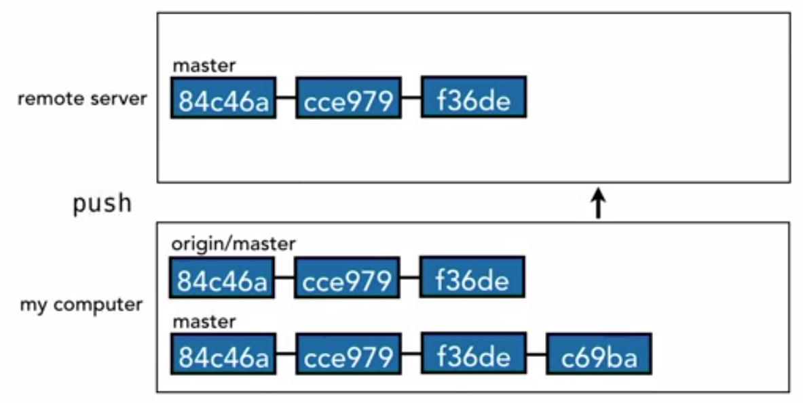

# Git Remote

## Git push

## Git fetch

## Git merge

The above representaion is not exactly how git stores the commits. It uses pointers.

When there is a new commit on the remote server.

We have to fetch it on to our origin/master.

In order to have our local master to point to the origin/master we need to merge. It is a fast forward merge.

Origin master is really just a branch. It's just like all the other branches that we've been creating and working with. The only difference is that it's a branch that tries to stay in sync with what's on the remote server. The reason that matters, is because it's possible for someone to make a commit on the remote server while we're also in the process of making a commit on our local machine. It happens all the time. I'm making changes to one part of my project. My collaborator is making changes to their part of the project. They put their changes on the remote server and then when I do a fetch, it brings those changes down to my computer. You see that origin master, does point to those two new commits but in the meantime, on my branch on my local computer, I've made a new commit that's labeled ba8ce. Now, our two branches have diverged, so we need to do a merge to bring them back together again and that process works exactly the same way as when we were working with merging branches in the previous chapters. Origin master is just a branch so we can merge them together. It can either be a fast forward merge or it can be a real merge that creates a new merge commit. 

This means that, generally speaking, the process you'll go through when you're working with a remote, is that 
- you'll make your commits locally 
- then fetch the latest code from the remote server to bring your origin branch in sync 
- then merge any of your new work you just did into that branch and push the results back up to the remote server.
