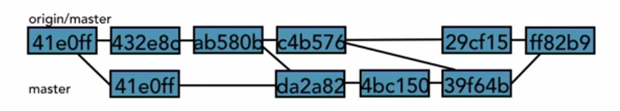

# Remote Account

## Add a remote account

`git remote`: we can see all the remotes in the repository.

To create a remote , `git remote add <NameOftheRemote> <url of the repository>`, generally used name is origin. `git remote add origin <url>`

`git remote -v`: Will give more information of the remote. 

Example:
```
>> git remote -v
origin  https://github.com/rajputsher/git_essentials.git (fetch)
origin  https://github.com/rajputsher/git_essentials.git (push)
```

One can have more than one remote.  Details about the remote can be seen in the file .git/config

```
[core]
        repositoryformatversion = 0
        filemode = false
        bare = false
        logallrefupdates = true
        symlinks = false
        ignorecase = true
[remote "origin"]
        url = https://github.com/rajputsher/git_essentials.git
        fetch = +refs/heads/*:refs/remotes/origin/*
[branch "master"]
        remote = origin
        merge = refs/heads/master
```

## Removing the remote.

This is rarely done. It can be done using : `git remote rm origin`

## Create remote branch.

`git push -u origin master` Creates a new branch on the remote. We can see the remote in the folder `.git/refs/remotes` 

might look different on linux when using the command `ls -la .git\refs\remotes`

```
>> dir .\.git\refs\remotes\
Mode                LastWriteTime         Length Name
----                -------------         ------ ----
d-----       27.03.2019     20:17                origin

>> dir .\.git\refs\remotes\origin

Mode                LastWriteTime         Length Name
----                -------------         ------ ----
-a----       27.03.2019     20:17             41 master
-a----       23.03.2019     19:44             41 reset_branch
-a----       23.03.2019     19:44             41 shorten_the_text
-a----       23.03.2019     19:45             41 test_git_branch
-a----       25.03.2019     12:40             41 text_edits
```
each file contains the SHA values of the most recent commit(tip) on that branch.


## Clone a Remote repository.

`git clone <url of the repo>`

## Track remote branches

Tracking is merging the changes in the Origin/master to the local master, to not have large different between the remote and local repo.



Git will track this for us automatically, if we have used the option `-u` or `--upstream` when we setup the remote `git push -u origin master`

we can see which branches are tracking in the .git/config file.

```
>>cat .git/config
[core]
        repositoryformatversion = 0
        filemode = false
        bare = false
        logallrefupdates = true
        symlinks = false
        ignorecase = true
[remote "origin"]
        url = https://github.com/rajputsher/git_essentials.git
        fetch = +refs/heads/*:refs/remotes/origin/*
[branch "master"]
        remote = origin
        merge = refs/heads/master
```

Here only the master branch is tracking the repo and not the other branches on the local repo.

Ex: 
Let us create a branch and see how we can track and untrack it.

1. `git branch -u origin/non_tracking non_tracking`
```
>> git checkout non_tracking
Switched to branch 'non_tracking'

>> git push origin non_trackin
g
Total 0 (delta 0), reused 0 (delta 0)
remote:
remote: Create a pull request for 'non_tracking' on GitHub by visiting:
remote:      https://github.com/rajputsher/git_essentials/pull/new/non_tracking
remote:
To https://github.com/rajputsher/git_essentials.git
 * [new branch]      non_tracking -> non_tracking

>> cat .git/config
[core]
        repositoryformatversion = 0
        filemode = false
        bare = false
        logallrefupdates = true
        symlinks = false
        ignorecase = true
[remote "origin"]
        url = https://github.com/rajputsher/git_essentials.git
        fetch = +refs/heads/*:refs/remotes/origin/*
[branch "master"]
        remote = origin
        merge = refs/heads/master


>> git branch -u origin/non_tr
acking non_tracking
Branch 'non_tracking' set up to track remote branch 'non_tracking' from 'origin'.

>> cat .git/config
[core]
        repositoryformatversion = 0
        filemode = false
        bare = false
        logallrefupdates = true
        symlinks = false
        ignorecase = true
[remote "origin"]
        url = https://github.com/rajputsher/git_essentials.git
        fetch = +refs/heads/*:refs/remotes/origin/*
[branch "master"]
        remote = origin
        merge = refs/heads/master
[branch "non_tracking"]
        remote = origin
        merge = refs/heads/non_tracking
```
Not the branch non_tracking is tracking the remote origin/non_tracking

2. To untrack it we need to use the option `--unset-upstream`

```
>> git branch --unset-upstream non_tracking

>> cat .git/config
[core]
        repositoryformatversion = 0
        filemode = false
        bare = false
        logallrefupdates = true
        symlinks = false
        ignorecase = true
[remote "origin"]
        url = https://github.com/rajputsher/git_essentials.git
        fetch = +refs/heads/*:refs/remotes/origin/*
[branch "master"]
        remote = origin
        merge = refs/heads/master
```
Now the non_tracking branch is not tracked.