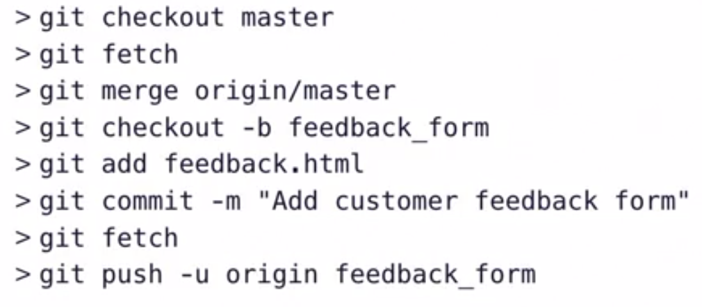

# Collaborate with remote

## Push Changes

Let us make changes to tours.html 
```
> git status
On branch master
Your branch is up to date with 'origin/master'.

Changes not staged for commit:
  (use "git add <file>..." to update what will be committed)
  (use "git checkout -- <file>..." to discard changes in working directory)

        modified:   4_explore_california/tours.html

no changes added to commit (use "git add" and/or "git commit -a")

>> git add .\4_explore_california\tours.html

>> git commit -m "Changes URL format on tours page"
[master a092b0a] Changes URL format on tours page
 1 file changed, 8 insertions(+), 8 deletions(-)

>> git log --oneline -3
a092b0a (HEAD -> master) Changes URL format on tours page
cacbf7b (origin/master) remote tracking, untracking
9555d7d git remote tracking

>> git log --oneline -3 origin/master
cacbf7b (origin/master) remote tracking, untracking
9555d7d git remote tracking
711754f (origin/non_tracking) Working with remote
```

Above we can see the log of master and origin/master. We can see that origin/master is one commit behind. we can see the changes : `git diff origin/master..master --color-words`

Now we have the changes locally, we need to push this to the remote.
`git push origin master` or `git push` if already on master.

## Fetch changes 

`git fetch` : Gets all that is on the remote repo to local repo. It is important to note that the local master will not be pointing to the origin\master yet. 

## Merge in fetched changes

`git merge origin/master` : i.e we are merging the origin/master with master.

We always need to use these 2 commands : `git fetch` + `git merge` or use `git pull` which will do both together.

## Check out remote branches

When we clone the repository as a new contributor to the repo with `git clone <URL> <DirName>`. It only clones the master and not the other branches if there are any.
```
>> git branch
* master

>> git branch -r
  origin/HEAD -> origin/master
  origin/master
  origin/non_tracking
  origin/reset_branch
  origin/shorten_the_text
  origin/test_git_branch
  origin/text_edits
```

Here we can see, there are multiple branches on remote where as only master on local.

in order to checkout the branch to the local repo, we can do that by ex,: `git branch non_tracking origin/non_tracking`. This will create the branch on local from remote and this can be seen with the log where both the remote and local are pointing to the same commit. It can also be seen in the config file that the non tracking branch is added.

```
>> git branch non_tracking origin/non_tracking
Branch 'non_tracking' set up to track remote branch 'non_tracking' from 'origin'.

>> git log --oneline -4 non_tracking
711754f (origin/non_tracking, non_tracking) Working with remote
56cd4e0 git stash,retrieve stash, delete stash
4521b92 Merge branch 'text_edits'
9088739 Modified text in master branch

>> cat .\.git\config
[core]
        repositoryformatversion = 0
        filemode = false
        bare = false
        logallrefupdates = true
        symlinks = false
        ignorecase = true
[remote "origin"]
        url = https://github.com/rajputsher/git_essentials.git
        fetch = +refs/heads/*:refs/remotes/origin/*
[branch "master"]
        remote = origin
        merge = refs/heads/master
[branch "non_tracking"]
        remote = origin
        merge = refs/heads/non_tracking
```

So the remote branches cannot be checked out directly, they need to be first created based on the branch in the remote and then checkout to that branch.

## Push to an updated remote branch

When we have made changes to our local repo, in the mean time collaborators have commited to the origin/master, we cannot directly push this to the remote, this might give us error.


Instead, we need to first fetch the origin/master and then perform the merge (either fast forward merge/ normal merge) and then push again 


## Delete a remote branch

- Remove a branch from the remote repository 
- Useful when a feature branch is complete and merged

Currently there are following branches on remote
```
>> git branch -r
  origin/HEAD -> origin/master
  origin/master
  origin/non_tracking
  origin/reset_branch
  origin/shorten_the_text
  origin/test_git_branch
  origin/text_edits
```

There are different ways of deleting the remote branches:

1. Not so intuitive approach is : `git push origin :non_tracking` , using ":" in the begining of the branch name

Which this works? Because, when we do normal push what is actually happening is `git push origin non_tracking:non_tracking` , when we are deleting `git push origin :non_tracking`, we are saying push nothing to non_tracking i.e empty it. 


2. `git push origin --delete non_tracking`, this will do the same as above command but the command is more clear on what it is doing.


## Colaboration Workflow

Let us consider I wanted to make a changes to the the project, I created a new branch triedout the new feature and now pushed it as shown below in the flow.



I mail to the other collaborator/s about the new feature in the new branch, from the collaborator point of view: The collaborator does the following, makes a minor change to the branch and pushes it.


Ball is now in my court again. I see the changes made by the collaborator and I see it is a good change, then I merge it to the remote branch and then to the master branch so all the other colleagues can see the new feature on the remote master.


