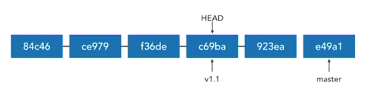
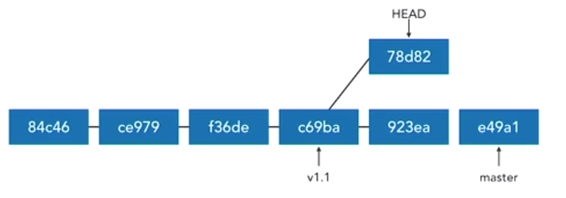
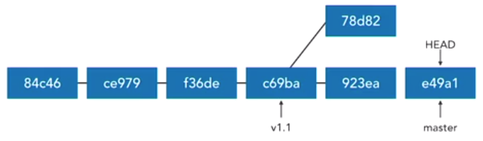

## Create Tags

- Tags allow marking points in history as important
- A named reference to a commit
- Most often used to mark releases (v1.0,v1.1,v2.0..)
- Can mark key features or changes 
- Can mark points for team discussions(new_feature, bug, issue212 etc..)

There are 2 ways of tagging: <br/>
1. `git tag <tag_name> <commit_SHA>`. Ex: `git tag issue122 6789fcdbe2`

2. Annotated tag: `git tag -a <tag_name> -m "<message>" <Commit_SHA>`. <br/> Ex: `git tag -a v1.1 -m "Version 1.1" dca223455bd`. If we leave out the `<commit_SHA>` git will use the current HEAD.

Example :
```
>> git tag -am "Chapter 15" C_15 90050759dcf2e ## Tagged end of chapter 15

>> git tag C_14 be643b17aa41c139f ## Tagged end of chapter14 commit
```
## List tags

`git tag` or `git tag --list` or `git tag -l`

To list tag with certain characters or use regex: `git tag -l "v2*"`. To see the list with annotation `git tag -l -n` or `git tag -ln`.

Example: 
```
>> git tag -l
C_14
C_15

>> git tag
C_14
C_15

>> git tag --list -n ## See list with annotation
C_14            Forced push
C_15            Chapter 15
```
## Work with tags (like SHAs)

- `git show v1.1`
- `git diff v1.0..v1.1`

## Delete tags

- `git tag --delete v1.1`
- `git tag -d v1.1`

## Push tags to remote

- git push does not transfer tags.
- Tags must be explicitly transferred.
- git fetch automatically retrieves shared tags.

Pushing a tag to remote : `git push origin <tag_name>`. Ex: `git push origin C_14`.

To push all the tags to remote: `git push origin --tags`

## Delete remote tags 

- `git push origin :<tag_name>`
- `git push --delete origin <tag_name>`
- `git push -d origin <tag_name>`

Example:
```
>> git push origin C_14
Total 0 (delta 0), reused 0 (delta 0)
To https://github.com/rajputsher/git_essentials.git
 * [new tag]         C_14 -> C_14

>> git push --tags
Enumerating objects: 1, done.
Counting objects: 100% (1/1), done.
Writing objects: 100% (1/1), 161 bytes | 80.00 KiB/s, done.
Total 1 (delta 0), reused 0 (delta 0)
To https://github.com/rajputsher/git_essentials.git
 * [new tag]         C_15 -> C_15

>> git push origin :C_14
To https://github.com/rajputsher/git_essentials.git
 - [deleted]         C_14
```

## Cheking out tags

- Tags are not branches 
- Tags can be checked out, just like any commit.
- `git checkout -b <new_branch_name> <tag_name>`: Will create a branch from the tagged commit.
- `git checkout <tag_name>`. ex: `git checkout v1.1` will not create a new branch instead will move the head to that commit. This is lead to a Detached HEAD state. 


In Detached head state: 
- It is like being on an unarmed branch
- New commits will not belong to any branch 
- Detached commits will be garbage collected (~2 Weeks)

What happens when we make commits from this stage is that we create an unnamed branch as shown below: 



When we move back to the master branch, there is no easy way to get back to the commit made on that unnamed branch. 




There are a few ways to get back to such branches: 

- Tag the commit on the unnamed branch. Ex: `git tag temp` 
- Create a branch (HEAD detached). `git branch temp_branch`
- Better way of doing it is to create a branch and reattach HEAD. `git checkout -b temp_branch`
