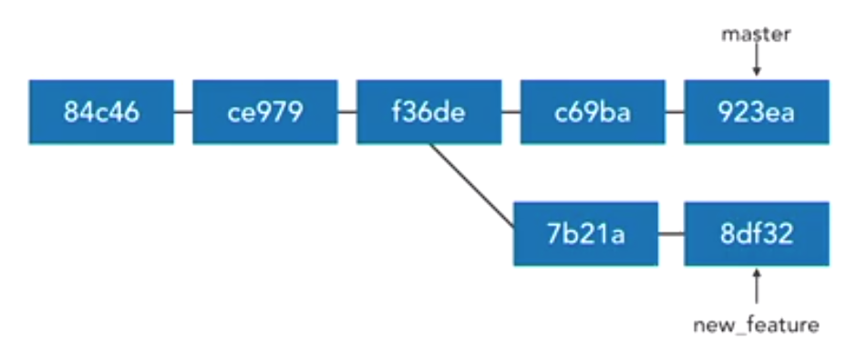
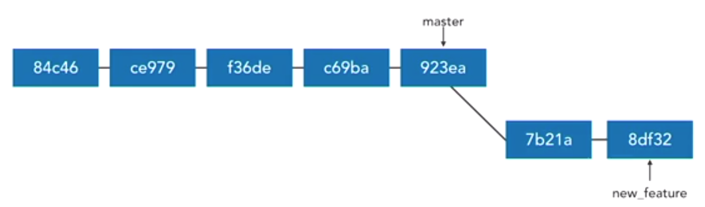
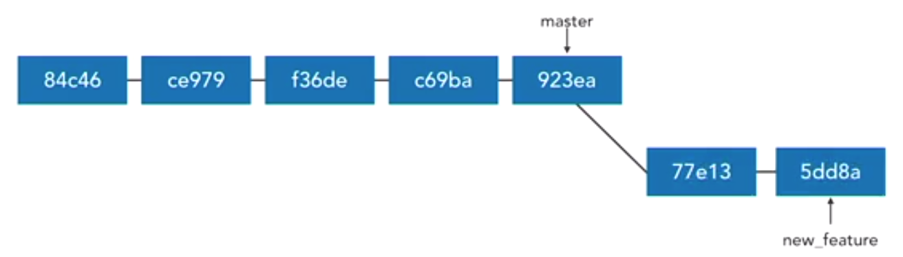
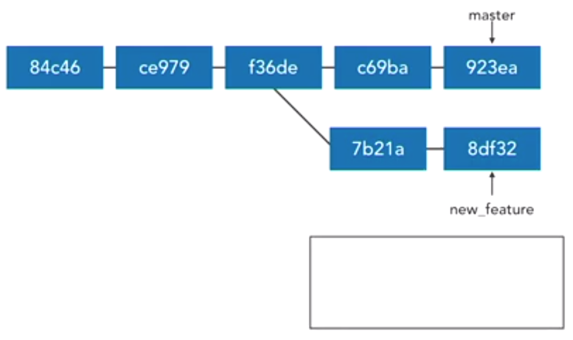
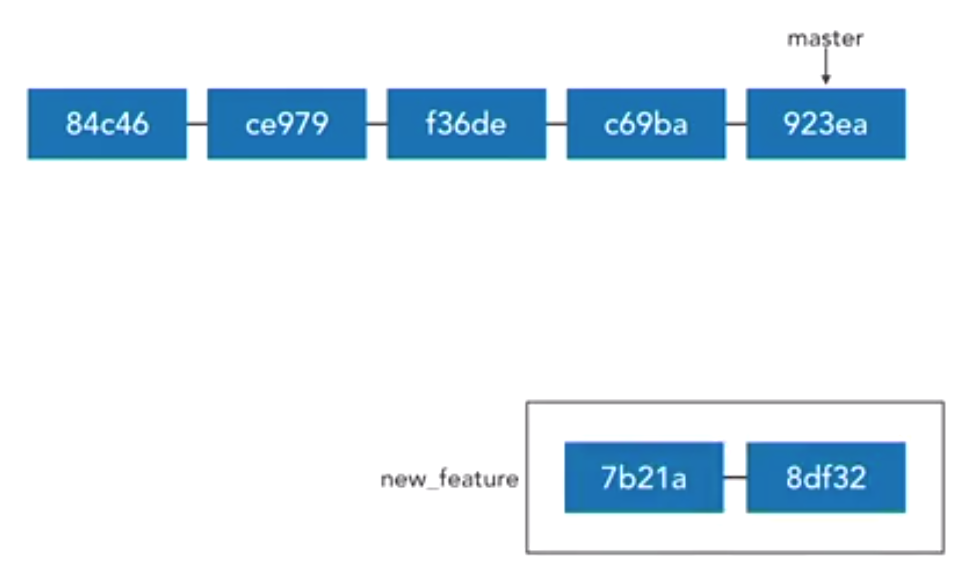
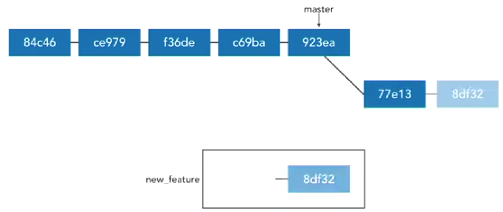
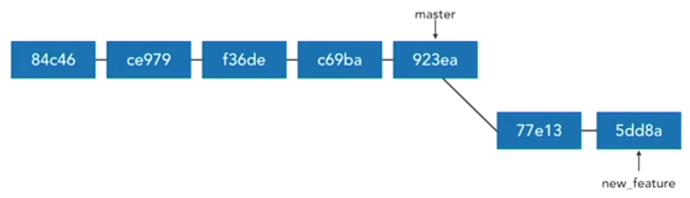
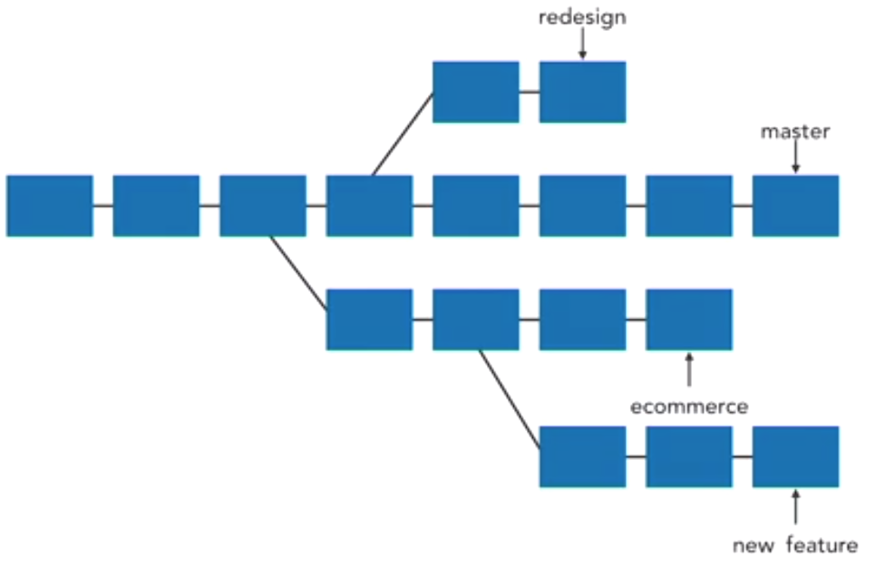
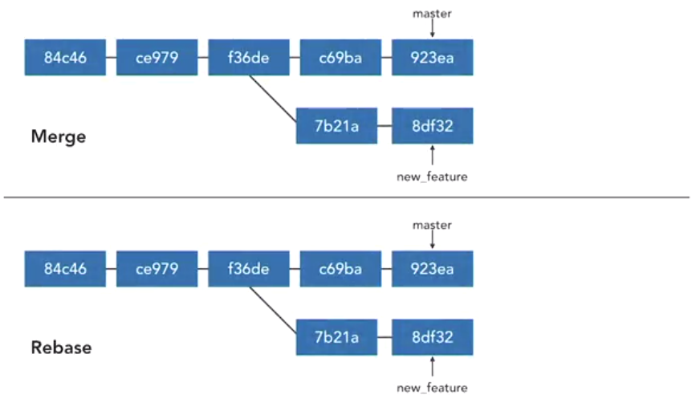
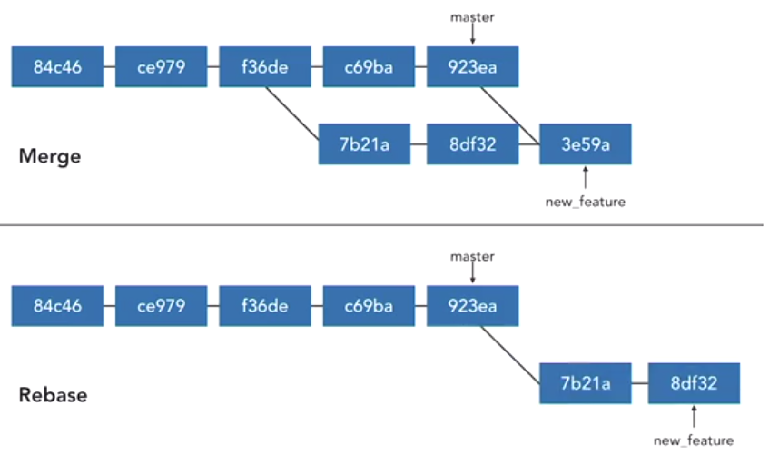

# Rebasing

## Rebase commits

- Take commits from a branch and replay them at the end of another branch 
- Useful to integrate recent commits without merging
- maintains a cleaner, more linear project history 
- Ensures topic branch commits apply cleanly

Example: 
1. We have created a new_feature branch and have made 2 commits.<br/>


2. By rebasing we are moving the new_feature branch and putting them at the beginning of the master branch.<br/>


3. With that the SHA of those commits will change. <br/>



A slightly more detailed version of what's actually happening.
-  When we say that we want to rebase the commits a new feature off of master, what git does is it starts rewinding the new feature branch, or picking up each one of those commits and putting them into temporary storage, and it keeps doing that until it gets back to a commit where it diverged from the master branch. <br/>



- Then, it moves to the tip of the master branch, and it replays each one of those commits. So, while it may be conceptually useful to think of just shifting your branch down to the end, what it's actually doing is picking up each one of those commits, one-by-one, and then replaying them at the end. <br/>



- That's useful because, as we'll see later, we don't have to just move it to the tip of master. We can pick up the commits that are in new feature, and we can move them to the tip of our master branch, to the tip of our redesign branch, or to the tip of an e-commerce branch. It's up to us. In every case, git is just going to pick up the commits, and then replay them where we tell it. <br/>



How to rebase? 
- To rebase current branch to the tip of the master <br/>
`git rebase master`.
- To rebase a specific branch to tip of the master <br/> `git rebase master new_feature`

Useful for visualizing branches: <br/>
`git log --graph --all --decorate --oneline`

Return commit where topic branch diverges: <br/>`git merge-base master new_feature`

Example:

1. Create a new branch 'camping'. Make a couple of commits.

```
>> git checkout -b camping
Switched to a new branch 'camping'

>> git status
On branch camping
Untracked files:
  (use "git add <file>..." to include in what will be committed)

        15_BranchManagement/CampingList.txt

nothing added to commit but untracked files present (use "git add" to track)

>> git add .

>> git commit -am "Todo List for weekend Camping"
[camping 0abeeb7] Todo List for weekend Camping
 1 file changed, 5 insertions(+)
 create mode 100644 15_BranchManagement/CampingList.txt

>> git commit -am "Todo: Add activities "
[camping e493cb0] Todo: Add activities
 1 file changed, 5 insertions(+), 1 deletion(-)

>> git log --oneline
e493cb0 (HEAD -> camping) Todo: Add activities
0abeeb7 Todo List for weekend Camping
4123594 (master) Git Rebasing
6523b77 (tag: C_17, origin/master) interactive staging
dec6aeb Checkout tags
6c77d46 Deleting tags locally and in remote
7e4d820 tagging commits
9005075 (tag: C_15) git remote prune
```

2. Now moving back to the master branch let us make a change to another file.

```
>> git checkout master
Switched to branch 'master'
Your branch is ahead of 'origin/master' by 1 commit.
  (use "git push" to publish your local commits)

>> git commit -am "Todo: Shopping list updates"
[master 0c10d62] Todo: Shopping list updates
 1 file changed, 8 insertions(+), 1 deletion(-)

>> git log --graph --all --decorate --oneline -6
* 3730b34 (HEAD -> master) Rebasing example
* 0c10d62 Todo: Shopping list updates
| * e493cb0 (camping) Todo: Add activities
| * 0abeeb7 Todo List for weekend Camping
|/
* 4123594 Git Rebasing
* 6523b77 (tag: C_17, origin/master) interactive staging
```

in the log we can see from the commit where we branched, there are 2 commits in the camping branch and 2 commits in the master branch. 

3. Now we can rebase: If we are on the camping branch, we can use `git rebase master`. If we are on master branch we can use `git rebase master camping`

```
>> git merge-base master camping
41235945116f7de6e61d4943356ba8c0c8ff8e2e

>> git rebase master camping
First, rewinding head to replay your work on top of it...
Applying: Todo List for weekend Camping
Applying: Todo: Add activities

>> git log --graph --all --decorate --oneline -6
* 2983a27 (HEAD -> camping) Todo: Add activities
* 86cb91e Todo List for weekend Camping
* 3730b34 (master) Rebasing example
* 0c10d62 Todo: Shopping list updates
* 4123594 Git Rebasing
* 6523b77 (tag: C_17, origin/master) interactive staging
```

After rebasing we can see that the commits from the master branch as it is, but the commits from the camping branch are moving to the tip of the master and the SHA changed.

## Merging vs Rebasing

Merging and rebasing are two ways of incorporating changes from one branch into another branch. Both gives us the same results, but the means are different.





Merging: 
- Adds a merge commit 
- It is non-destructive all the SHAs are not changed.
- Complete record of what happened and when it happened are avaialble
- Easy to undo commits by using reset
- Logs can become uncluttered and non-linear

Rebasing:
- No additional merge commits
- Destructive : SHA changes, commits are rewritten
- No longer complete record of what happened and when it happened are avaialble
- Tricky to undo 
- Logs are much cleaner and linear.

The golden rule of rebasing: <br/> You should not rebase a public branch
- Rebase abandons existing, shared commits and creates new, similar commits instead
- Collaborators would see the project history vanish
- Getting all collaborators back in sync can be a nightmare

How to choose ? 

- *Merge* when we want to allow commits to stand out or to be clearly grouped
- *Merge* to bring large topic branches back into master
- *Rebase* to add minor commits in master to a topic branch
- *Rebase* to move commits from one branch to another
- *Merge* anytime the topic branch is already public and bring used by others (The golden rule of rebasing)

## Resolve rebase conflicts

- Rebasing creates new commits on existing code
- May conflict with existing code
- When there is a conflict git pauses rebase before each conflicting commit.Similar to resolving merge conflicts.
- After resolving the commits , we need to use `git rebase --continue` to continue with the next conflict or `git rebase --skip` when you want to skip the conflict or `git rebase --abort` to stop rebasing.

## Rebase onto other branches

`git rebase --onto newbase upstream branch`<br/>
`git rebase --onto <new_base> <Old_branch it branched out of> <branch_to_rebase>`
Example: `git rebase --onto master ecommerce new_feature` 

Take new_feature branch off of the ecommerce branch and put it to the tip of the master branch.

Example: 
```
> git checkout -b expenses
Switched to a new branch 'expenses'

>> git status
On branch expenses
Untracked files:
  (use "git add <file>..." to include in what will be committed)

        15_BranchManagement/Expenses.txt

nothing added to commit but untracked files present (use "git add" to track)

>> git add .

>> git commit -m "Added Expenses"
[expenses 9d16cab] Added Expenses
 1 file changed, 7 insertions(+)
 create mode 100644 15_BranchManagement/Expenses.txt

>> git log --graph --all --decorate --oneline -9
* 9d16cab (HEAD -> expenses) Added Expenses
* 9085b2e (camping) Git rebase --onto
* 1a810c2 Update shopping list with orange
* 7e10843 Resolving rebase conflicts
* 3abbdac MergingVsRebasing
* ff7e9d2 Todo: Add activities
* 3cd03f8 Todo List for weekend Camping
* af728d9 (master) Update shopping list with Apple
* 3730b34 Rebasing example

>> git rebase --onto master camping expenses
First, rewinding head to replay your work on top of it...
Applying: Added Expenses

>> git log --graph --all --decorate --oneline -9
* 959e1fd (HEAD -> expenses) Added Expenses
| * 9085b2e (camping) Git rebase --onto
| * 1a810c2 Update shopping list with orange
| * 7e10843 Resolving rebase conflicts
| * 3abbdac MergingVsRebasing
| * ff7e9d2 Todo: Add activities
| * 3cd03f8 Todo List for weekend Camping
|/
* af728d9 (master) Update shopping list with Apple
* 3730b34 Rebasing example

>> git rebase --onto camping master expenses
First, rewinding head to replay your work on top of it...
Applying: Added Expenses

>> git log --graph --all --decorate --oneline -9
* f4340a1 (HEAD -> expenses) Added Expenses
* 9085b2e (camping) Git rebase --onto
* 1a810c2 Update shopping list with orange
* 7e10843 Resolving rebase conflicts
* 3abbdac MergingVsRebasing
* ff7e9d2 Todo: Add activities
* 3cd03f8 Todo List for weekend Camping
* af728d9 (master) Update shopping list with Apple
* 3730b34 Rebasing example
```

Here we can see how we rebased the expenses branch onto master and then on to camping. This can be seen in the log.

## Undo a rebase

- Can undo simple rebases 
- Data is lost: SHAs, commit messages etc.

If it is a simple rebase , i.e ORIG_HEAD has not changed again, we can use `git reset --hard ORIG_HEAD`

If we want to undo by rebasing to former merge-base SHAs: <br/>
`git rebase 834fde234 master new_feature`

Example of undo rebase: 
```
>> git log --graph --all --decorate --oneline -9
* f4340a1 (HEAD -> expenses) Added Expenses
* 9085b2e (camping) Git rebase --onto
* 1a810c2 Update shopping list with orange
* 7e10843 Resolving rebase conflicts
* 3abbdac MergingVsRebasing
* ff7e9d2 Todo: Add activities
* 3cd03f8 Todo List for weekend Camping
* af728d9 (master) Update shopping list with Apple
* 3730b34 Rebasing example

>> git rebase --onto master camping expenses
First, rewinding head to replay your work on top of it...
Applying: Added Expenses

>> git log --graph --all --decorate --oneline -9
* 3d38577 (HEAD -> expenses) Added Expenses
| * 9085b2e (camping) Git rebase --onto
| * 1a810c2 Update shopping list with orange
| * 7e10843 Resolving rebase conflicts
| * 3abbdac MergingVsRebasing
| * ff7e9d2 Todo: Add activities
| * 3cd03f8 Todo List for weekend Camping
|/
* af728d9 (master) Update shopping list with Apple
* 3730b34 Rebasing example

>> git reset --hard ORIG_HEAD
HEAD is now at f4340a1 Added Expenses

>> git log --graph --all --decorate --oneline -9
* f4340a1 (HEAD -> expenses) Added Expenses
* 9085b2e (camping) Git rebase --onto
* 1a810c2 Update shopping list with orange
* 7e10843 Resolving rebase conflicts
* 3abbdac MergingVsRebasing
* ff7e9d2 Todo: Add activities
* 3cd03f8 Todo List for weekend Camping
* af728d9 (master) Update shopping list with Apple
* 3730b34 Rebasing example
```
Here we can see in the log that the SHA before the rebase and current HEAD are the same.

## Interactive rebasing

`git rebase -i master new_feature`

## Pull rebase

- Fetch from remote, then rebase instead of merging
- Keeps history cleaner by reducing merge commits 
- only use on local commits not shared to a remote 

`git pull --rebase` or `git pull -r` or `git pull --rebase=preserve`


## Merging all the rebase to master

```
> git checkout master
Switched to branch 'master'
Your branch is ahead of 'origin/master' by 4 commits.
  (use "git push" to publish your local commits)

>> git merge camping
Updating af728d9..9085b2e
Fast-forward
 15_BranchManagement/CampingList.txt |   9 ++++
 15_BranchManagement/ToDoList.txt    |   3 +-
 18_Rebasing/README.md               |  87 ++++++++++++++++++++++++++++++++----
 18_Rebasing/images/10.png           | Bin 0 -> 118326 bytes
 18_Rebasing/images/9.png            | Bin 0 -> 148698 bytes
 5 files changed, 89 insertions(+), 10 deletions(-)
 create mode 100644 15_BranchManagement/CampingList.txt
 create mode 100644 18_Rebasing/images/10.png
 create mode 100644 18_Rebasing/images/9.png

>> git log --graph --all --decorate --oneline -11
* fe4b758 (expenses) Pull rebase
* dbad529 interactive rebasing
* f4340a1 Added Expenses
* 9085b2e (HEAD -> master, camping) Git rebase --onto
* 1a810c2 Update shopping list with orange
* 7e10843 Resolving rebase conflicts
* 3abbdac MergingVsRebasing
* ff7e9d2 Todo: Add activities
* 3cd03f8 Todo List for weekend Camping
* af728d9 Update shopping list with Apple
* 3730b34 Rebasing example

>> git merge expenses
Updating 9085b2e..fe4b758
Fast-forward
 15_BranchManagement/Expenses.txt |   7 +++
 18_Rebasing/README.md            | 129 +++++++++++++++++++++++++++++++++++++++
 2 files changed, 136 insertions(+)
 create mode 100644 15_BranchManagement/Expenses.txt

>> git push origin master
Enumerating objects: 67, done.
Counting objects: 100% (67/67), done.
Delta compression using up to 8 threads.
Compressing objects: 100% (63/63), done.
Writing objects: 100% (64/64), 1.09 MiB | 1.84 MiB/s, done.
Total 64 (delta 25), reused 0 (delta 0)
remote: Resolving deltas: 100% (25/25), completed with 2 local objects.
To https://github.com/rajputsher/git_essentials.git
   6523b77..fe4b758  master -> master
```