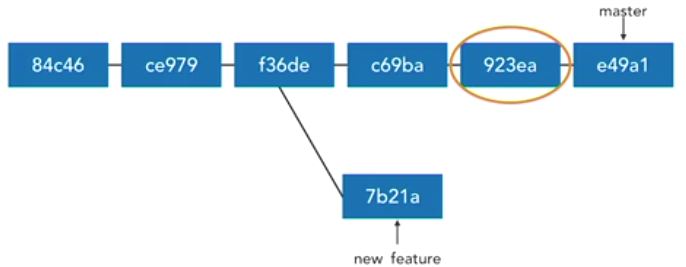
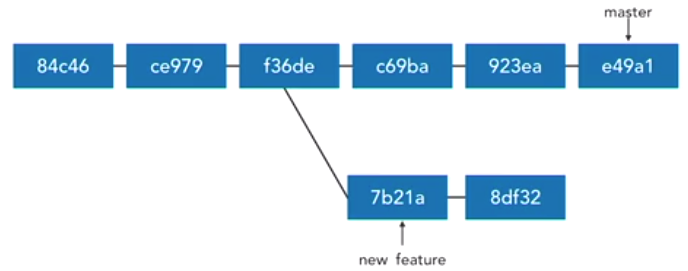
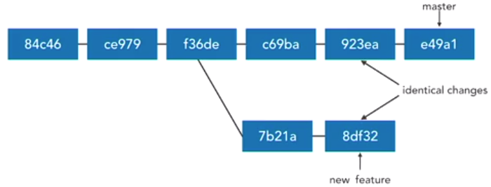

# Cherry Picking

How we can use different techniques to share code between branches or even different repositories? <br/>
We are going to start out by learning how to do cherry-picking. 
- Cherry-picking means that we apply the changes from one or more existing commits. 
- Each commit that we target is going to become a new commit on the current branch. We're essentially telling git, hey, go get that commit that you already know about, grab its changes, and apply them right here. 
- It's conceptually similar to doing a copy and paste. One reason that it's not exactly the same as copy and paste though is that the histories of each one are different, and therefore new commits are going to have different SHAs. 

Example of Cherry-picking :

1. If we want to use the changes made in a commit on master branch on our feature branch we can use cherry-pick <br/>
    

2. 
    

3. 
    

Usage:

- `git cherry-pick <SHA>`
- `git cherry-pick <FromSHA>..<ToSHA>`


Example : 

1. We want to use the changes made in the master branch in the SHA 4ea4118 in another branch expenses, we can do that using cherry-pick.

```
>> git log --oneline --graph --all --decorate -10
* e20f070 (HEAD -> master) Cherry picking images
* 4ea4118 Fixed Typo
* 00d37a9 (origin/master) Git log, blame and bisect
* 637e34f Ignore file
* 3ee254b Git rebase
* 59c26f9 Git rebase
* fe4b758 (expenses) Pull rebase
* dbad529 interactive rebasing
* f4340a1 Added Expenses
* 9085b2e (camping) Git rebase --onto
```

2. 

```
>> git checkout expenses
Switched to branch 'expenses'

>> git cherry-pick 4ea4118
[expenses a31994f] Fixed Typo
 Date: Sat Apr 10 17:17:44 2021 +0200
 1 file changed, 1 insertion(+), 1 deletion(-)

>> git log --oneline --graph --all --decorate -10
* a31994f (HEAD -> expenses) Fixed Typo
| * e20f070 (master) Cherry picking images
| * 4ea4118 Fixed Typo
| * 00d37a9 (origin/master) Git log, blame and bisect
| * 637e34f Ignore file
| * 3ee254b Git rebase
| * 59c26f9 Git rebase
|/
* fe4b758 Pull rebase
* dbad529 interactive rebasing
* f4340a1 Added Expenses
```
Now the changes same commit changes from master branch are on the expenses branch, the SHA has changed but the commit changes are the same.

Cherry picking commits:
- Cherry picking of a merge commit is not possible.
- We can use --edit or -e option in the cherry-pick command to change the commit command
- Cherry-picking might create conflicts, which should be resolved.

## Create Diff patches

- Diff patches are a way for us to be able to share changes using files, instead of transferring them via a "get remote repository." 
- This is useful whenever changes are not ready for a public branch, so we don't want to push it up toward the remote repository, or when we want to work with collaborators who don't share a remote with us. 
- This is often used during a discussion, a review, or an approval process. 
- The idea is just to package up changes into files and then those files can either be emailed or put into a thumb drive or something to be shared with someone else. 

Send an output to a file, we can do that using the command.
`echo "Hello" > temp.txt`

If there is no file names temp.txt, the above command will create it . If the file already exists, it will be overritten.

Usage:
`git diff <fromSHA> <ToSHA> > Output.diff` will create a Output.diff file and write the output of the git diff command

```
>> git diff a31994f  fe4b758 > output.diff
```

Contents of file 
```
diff --git a/15_BranchManagement/ToDoList.txt b/15_BranchManagement/ToDoList.txt
index 7affa43..aeb4e19 100644
--- a/15_BranchManagement/ToDoList.txt
+++ b/15_BranchManagement/ToDoList.txt
@@ -1,6 +1,6 @@
 Morning
 ==========
-Develop feature Alone
+Develop feature Alien
 Call the housing company
 Send the email to landlord
```

## Apply diff patches 

- Apply changes in a diff patch file to the working directory
- Make changes, but not commits this makes sense as the diff file above doesnot contain any commit history in it .

Usage : `git apply output.diff`

This will apply the patches in the new branch and will contain the changes. The commits needs to be done.

The patches will not be applied if the file is not as expected in the destination file to make the necessary changes.


## Create formatted patches

- Export each commit in Unix mailbox format
- Useful for email distribution of changes 
- Includes commit messages 
- One commit per file by default 

Usage : 
- Export all commits in the range : `git format-patch <FromSHA>..<ToSHA>` 
- Export all commits on current branch which are not in master branch: `git format-patch master` i.e all the commits fron current HEAD until master 
- Export a single commit `git format-patch -1 6552d`
- Put patch files into a directory `git format-patch master -o feature`
- Output patches as a single file : `git format-patch <FromSHA>..<ToSHA> --stdout > feature.patch`


Example : 

```
> git log --oneline --graph --decorate -5
* e20f070 (HEAD -> master) Cherry picking images
* 4ea4118 Fixed Typo
* 00d37a9 (origin/master) Git log, blame and bisect
* 637e34f (test_patch) Ignore file
* 3ee254b Git rebase

>> git format-patch 00d37a9..e20f070 -o .\20_CherryPicking\patches
.\20_CherryPicking\patches/0001-Fixed-Typo.patch
.\20_CherryPicking\patches/0002-Cherry-picking-images.patch
```


## Apply Formatted Patches 

- When we apply formatted patches , it extracts author, commit message, and changes from a mailbox message and apply them to the current branch. 

- It is similar to cherry-picking i.e gets same changes but different SHAs

- The main different between normal-patch and the formatted-patch is the commit histories are contained in the formatted patch . 

Usage : 
- Apply single patch : `git am <locationOfPatchFile>`
- Apply all patches in a directory: `git am <folderName/*.patch>`


