# Git Architecture

## The two tree architecture

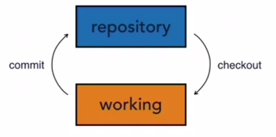

This is what a lot of  version control systems use. We have a repository and a working copy. These are our two trees. We call them trees because they represent a file structure. 
- At the top is the main project directory, and below that might be four or five different folders with a few files inside of them. Maybe a few more folders, each of those folders has a few more folders inside. You can imagine that if you map that out, each of those folders would branch out like the branches of a tree. 
- The repository also has a set of files in it, also arranged as a tree. When we want to move files between the repository or the working copy, we checkout copies, that's the term we use. 
- We check it out from the repository into our working directory, and when we finish making our changes, we commit those changes back to the repository. We have two distinct trees because the files may not be the same. 
- Imagine if I checkout a copy from the repository. I make some changes to it, I save those changes on my hard drive. Those changes are now permanent. They're saved in my working copy but they're not yet committed to the repository. My working copy would look different from the repository. Both are saved, but they're in different states. 
- Or, you can imagine another case. If the repository is a shared repository and many people are working from it, they may add their own changes to the repository. If I haven't checked out a copy recently, then my working copy won't have their changes. Now that's a typical two-tree architecture.

## The three-tree architecture

What git uses is a three-tree architecture. The additional tree is a staging index. i.e we add the changes and then commit. Similarly when pulling we can do it in 2 steps however, we commonly checkout the repository to working copy as shown in the second image here.

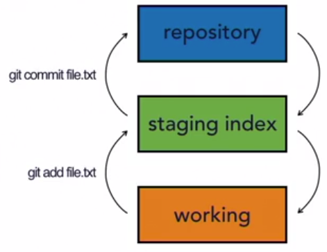

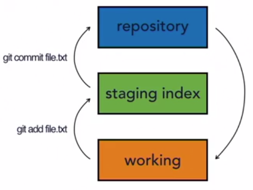


## Git work-flow

1. Make Changes

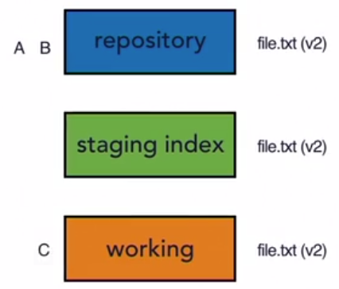

2. Add changes to Staging index

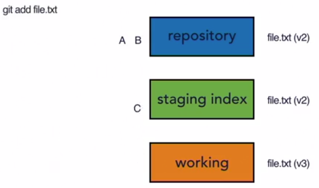

3. Commit changes to the repository

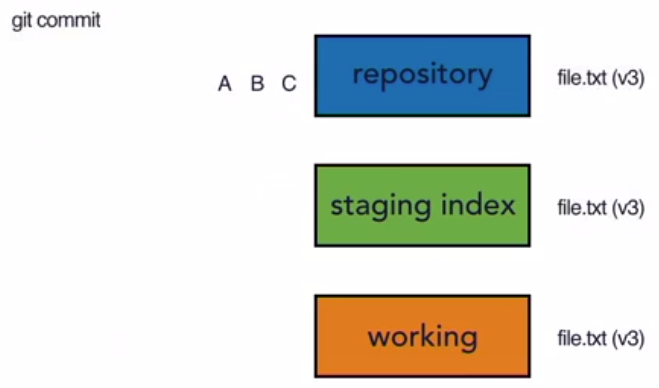

### Hash Values (SHA-1)
- Git generated a checksum for each change set 
- Checksum algorithms convert data into a simple number 
- Same data always equals same checksum
- Data integrity is fundamental
- Changing data would change checksum

Git SHA-1
-  Git uses SHA-1 hash algorithm to create checksums
- 40-character hexadecimal string (0-9,a-f)
- Example: 0615242dac44a1760880fe571a4f9c06dde111d2
- These checksums are what are used to label commits

In addition to using the code that's in each one of our snapshots, it also uses the metadata as well. That means that you can't change the commit message or the commit author or the parent of the commit without also changing its SHA value. That gives us a nice chain of data integrity because when it goes to generate snapshot A, it takes the parent, the author, the message, and all the code changes, and it generates its SHA value. Then when we make snapshot B, snapshot B also goes through that same process, but it includes the SHA value from snapshot A, so it's linked to A. If we were to change something in A, then A's SHA value would change and B won't point to it anymore. One of the really nice features about Git is the fact that this data integrity of not only our change sets, but also the history of changes and how they relate to each other is built in.

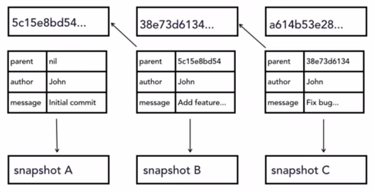


## HEAD 

HEAD is a pointer to the tip of the current branch in repository. It represents the last state of repository,what was last checked out.

Methaphor: The playback and record head on a cassette tape recorder. As we start recording audio, the tape moves past the head, and it records onto it. When we press stop, the place where that record head is stopped, is the place that it will start recording again, if we press record a second time. Now we can move around, we can move the head to different places, we can fast forward and rewind, but wherever the head is positioned when we hit record again, that's where it's going to start recording. The HEAD pointer in Git is very similar. It points to the place where we're going to start recording next. It's the place where we left off in our repository with what we've committed.

Example : 

Here we are on a master branch and HEAD is pointing to the first commit. Here commit ID is represented only by the first 6 characters of SHA-1 checksum.

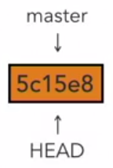

After the second commit 

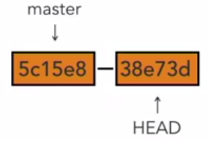

Third commit:

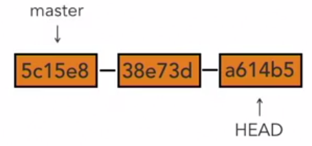

Similarly the HEAD points the latest working repository on a given branch. 

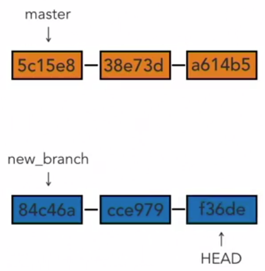

In information about where the HEAD is pointing to can be sen in the .git/HEAD file. This file stores location of the file where the current commit ID (SHA value) is stored

```
cat .git/HEAD
ref: refs/heads/master
```

```
cat .git/refs/heads/master
3584242dac44a1760880fe571a4f9c06dde111d2
```

## Stage and Commit Shortcut 

Instead of `git add .` and `git commit -m ""` , if we are sure that all the changes that are made needs to be commited then we can use the shortcut `git commit -a` or `git commit --all`. 

- This shortcut stages and commits all changes to the tracked files.
- Does not include untracked files.

to include message in the commit use `git commit -am "Edited all files, containing xyz and replaced it with jkl"`