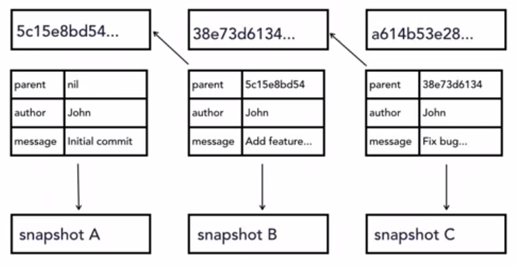

# Undo Changes


## Undo working directory changes

To undo changes before staging: 
1. Check status- `git status` to identify the changed files
2. To check the difference: `git diff --color-words`
3. To undo the changes: `git checkout -- <filename>`

e.g: `git checkout -- index.html`


## Unstage files

To undo changes that is on our stagin tree, i.e we want to unstage them and put them back like they were. Make the staging tree match the git repository.

1. Check status- `git status` to identify the changed file which are in stagged to commit.

```
On branch master
Your branch is up to date with 'origin/master'.

Changes to be committed:
  (use "git reset HEAD <file>..." to unstage)

        modified:   tours.html
        modified:   tours/tour_detail_backpack.html
        modified:   tours/tour_detail_bigsur.html

Changes not staged for commit:
  (use "git add <file>..." to update what will be committed)
  (use "git checkout -- <file>..." to discard changes in working directory)

        modified:   contact.html
        modified:   explorers.html
        modified:   index.html
        modified:   mission.html
        modified:   resources.html
        modified:   resources/faq.html
        modified:   support.html
```
2. git gives us the command in `git status` to unstage the staged files. i.e `git reset HEAD <file>`

Ex: `git reset HEAD tours*` to unstage all the files in tours folder. 
`git status` now shows as below

```
On branch master
Your branch is up to date with 'origin/master'.

Changes not staged for commit:
  (use "git add <file>..." to update what will be committed)
  (use "git checkout -- <file>..." to discard changes in working directory)

        modified:   contact.html
        modified:   explorers.html
        modified:   index.html
        modified:   mission.html
        modified:   resources.html
        modified:   resources/faq.html
        modified:   support.html
        modified:   tours.html
        modified:   tours/tour_detail_backpack.html
        modified:   tours/tour_detail_bigsur.html
```
3. To undo the changes current working directory, we can use the commands from previous section.
Ex: `git checkout -- .` "." to undo changes to add files.

`git status` now: 
```
On branch master
Your branch is up to date with 'origin/master'.
```

## Ammend commits in the respository

Amending commits that are already in the respository.




We know from the git architecture that SHA values are generated for each one of our snapshots.
- Every time we take a commit, Git takes all of the code changes that we're making, as well as the metadata about the commit, runs it through an algorithm, and comes up with that SHA value, and when it goes to make the next commit, it uses the previous SHA value, the parent value, in the next commit, so when we generate a snapshot for B, we come up with a SHA value 38e73 and so on. 
- Then when snapshot C needs to have a commit made, all of its code changes, all of its metadata including that SHA value, get used to generate its value. This is an important aspect of the way that Git maintains data integrity, and makes sure that you can't change the history of commits. 
- That has important implications for amending commits because if we go and try and make a change to snapshot B, whether that change is changes to the code, changes to the commit message, to the author, or even just to the date, so that the date is today's date instead of the original date, all of those things would change the SHA that gets generated, and that would then break the chain because now snapshot C won't be pointing at that previous commit anymore.

Git does not want us to change the previous commits back in the chain, this can be done but it is not straight forward. However, the exception is that we can change the most recent commit, the one that HEAD is pointing to. In the example above, if we make changes to the snapshot C , it would not break the link in the chain because it is the last link in the  chain right now. There is nothing that is depending on it, so that is the one commit that we are able to edit.

Ex: 
1. Make changes to the resources.html file. The following changes(++/--) were made:

`git diff --color-words`
```
git diff
index 71826dd..c66e6de 100644
--- a/resources.html
+++ b/resources.html
@@ -94,14 +94,14 @@
               <ul>
                 <li>Comfortable hiking shoes</li>
                 <li>Hat</li>
+                <li>Sunglasses</li>
+                <li>Sunscreen</li>
                 <li>Wet/dry bag to protect valuables</li>
                 <li>Comfortable backpack</li>
                 <li>Stainless steel water bottle</li>
                 <li>Multi-purpose tool</li>
                 <li>Pack no more than one additional day of clothing</li>
                 <li>Insect repellent</li>
-                <li>Sunglasses</li>
-                <li>Sunscreen</li>
               </ul>
             </li>
             <li>Bring comfortable shoes. (I know, we shouldn<E2><80><99>t have to say that, but you<E2><80><99>d be amazed)</li>
```

2. `git commit -am "Changes priority of items to bring"`
3. `git log --oneline`
```
0cbdd31 (HEAD -> master) Changed priority of items to bring
9e47576 (origin/master)         mULTIple changed made to the READEME file. The added git compare and git commit multiple line commit message
b2326e7 changed you'll to you will
fd84032 replaced all contacts ending with 4315 with 4314
8bc839e Stage and Commit shortcut added
```
4. Now I want to make another change but I want it to be ammended with the commit 0cbdd31 (HEAD -> master) .
Changes(+/-) made can be seen with `git diff`
```
diff --git a/resources.html b/resources.html
index c66e6de..e545710 100644
--- a/resources.html
+++ b/resources.html
@@ -96,12 +96,12 @@
                 <li>Hat</li>
                 <li>Sunglasses</li>
                 <li>Sunscreen</li>
+                <li>Insect repellent</li>
                 <li>Wet/dry bag to protect valuables</li>
                 <li>Comfortable backpack</li>
                 <li>Stainless steel water bottle</li>
                 <li>Multi-purpose tool</li>
                 <li>Pack no more than one additional day of clothing</li>
-                <li>Insect repellent</li>
               </ul>
             </li>
             <li>Bring comfortable shoes. (I know, we shouldn<E2><80><99>t have to say that, but you<E2><80><99>d be amazed)</li>
```
5. Now amending this change with the previous commit. 

`git commit --amend -m "Reorder recommended items to carry for trip"`

now, `git log --oneline` shows:
```
75d92ab (HEAD -> master) Reorder recommended items to carry for trip
9e47576 (origin/master)         mULTIple changed made to the READEME file. The added git compare and git commit multiple line commit message
b2326e7 changed you'll to you will
fd84032 replaced all contacts ending with 4315 with 4314
8bc839e Stage and Commit shortcut added
ce78e7e added : git diff --color-words
``` 

here we can see that the previous head 0cbdd31 is now not seen in the commit log. and there is a new HEAD with a different SHA.

6. Check the changes to this new SHA.

`git show 75d92ab` : This contains both the changes in the single commit.

```
commit 75d92ab85757a43338bd27de5a855495dadb20c2 (HEAD -> master)
Author: rajputsher <shersingh72@gmail.com>
Date:   Fri Mar 19 20:19:12 2021 +0100

    Reorder recommended items to carry for trip

diff --git a/resources.html b/resources.html
index 71826dd..c66e6de 100644
--- a/resources.html
+++ b/resources.html
@@ -94,14 +94,14 @@
               <ul>
                 <li>Comfortable hiking shoes</li>
                 <li>Hat</li>
+                <li>Sunglasses</li>
+                <li>Sunscreen</li>
+                <li>Insect repellent</li>
                 <li>Wet/dry bag to protect valuables</li>
                 <li>Comfortable backpack</li>
                 <li>Stainless steel water bottle</li>
                 <li>Multi-purpose tool</li>
                 <li>Pack no more than one additional day of clothing</li>
-                <li>Insect repellent</li>
-                <li>Sunglasses</li>
-                <li>Sunscreen</li>
               </ul>
             </li>
             <li>Bring comfortable shoes. (I know, we shouldn<E2><80><99>t have to say that, but you<E2><80><99>d be amazed)</li>
```

Therefore the ammend commit does is : 
- whatever was in the old commit, bring it back down to staging, add whatever staging has into it, and then let's recommit that. I'm going to amend it with those new changes. That's how you can think of it. I
- It's taking what's in the last commit, bringing it down, adding your new stuff to it, and recommitting it, and generating a new SHA in the process.

## Retreiving old versions

We saw from the previous section that git allows amending only the most recent commit. If we want to change something in the old versions of the git we need to retreive it.

This can be done using: `git checkout <SHA Value> -- <filename>`

## Revert a commit

`git revert <SHA value>`, this opens a text editor to ender the message and also tell the SHA that will be reverted and creates a new commit with a SHA.

## Remove untracked files in the repository.

