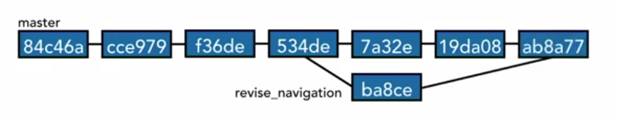
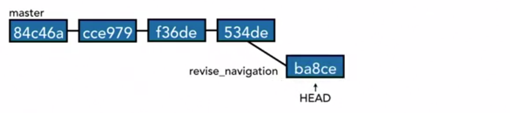
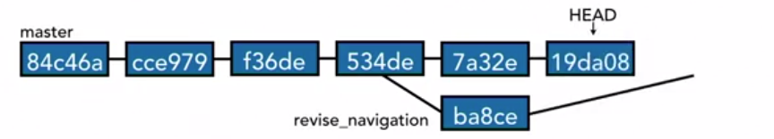

# Git Branching

Branches are one of the most powerful features in Git, in large part because of how easy they are to use. It's as if Git wants you to branch, and getting the most out of Git will mean using branches often and effectively. 
- In Git, branches are cheap. They're easy to create, they don't take a lot of processor power, they don't take up a lot of storage space, they're easy to delete, and they're easy to work with. That means branches make it easy to try new ideas. 
- Let's imagine that you have your master branch that you're working on, and suddenly you get an idea for something, but you're not sure if it's going to work out or not. Instead of making a lot of commits to your master branch and then trying to undo those if it doesn't work out, instead, you can create a new branch and try your ideas there. If those ideas don't work out, you just throw away the branch, and you haven't tainted your master timeline with those mistakes. If it does work out, then you can fold those changes back into the master branch through a process called merging.

Example of branching :



HEAD moves around depending on the tip of the current branch we are on.





## Creating branches

The command `git branch` will show us the available branches in the git repository.

```
>>git branch
* master
```
Here we have only master branch. and * indicates the current branch.


To create a new branch: `git branch new_feature` 

```
>>git branch
* master
  new_feature
```
To show where the cuurent HEAD is pointing, we can see .git/HEAD file.
`cat .git/HEAD`.

```
>> cat .git/HEAD
ref: refs/heads/master
```

The folder refs/heads/ contains multiple files showing different branches. On windows, this might look different on Unix based OS:
```
Mode                LastWriteTime         Length Name
----                -------------         ------ ----
-a----       21.03.2019     16:08             41 master
-a----       21.03.2019     16:08             41 new_feature
```

Right now both these files contain the same content as there is no new commit in the branch.

```
>>cat .\.git\refs\heads\master
aca2cdeb4f2fedfc2a033f2b141884b79f9d8d00

>> cat .\.git\refs\heads\new_feature
aca2cdeb4f2fedfc2a033f2b141884b79f9d8d00
```

We can confirm that the head is pointing to both the main branch and the new_feature by `git log --oneline` which gives: 
```
>>git log --oneline
aca2cde (HEAD -> master, new_feature) commit before creating new_feature branch
29a4849 (origin/master) Navigating the commit tree
4339bfb Change folder name from 6_gitignore to 6_git_ignore
b961c18 remove untracked files
d30be48 Undo changes in git
75d92ab Reorder recommended items to carry for trip
```
## Switch branch

Now to switch to the new_feature branch we need to checkout:
`git checkout new_feature`

```
>>git checkout new_feature
Switched to branch 'new_feature'

>>git branch
  master
* new_feature

>>cat .\.git\HEAD
ref: refs/heads/new_feature
```

Here we can see that the HEAD is now pointing to the new_feature branch.

```
> git status
On branch new_feature
Untracked files:
  (use "git add <file>..." to include in what will be committed)

        8_Branching/fileforabranch.txt

> git add .
> git commit -am "Add file to new_feature branch"
[new_feature 36e6994] Add file to new_feature branch
 1 file changed, 1 insertion(+)
 create mode 100644 8_Branching/fileforabranch.txt
```
Now the git log commit shows : 
```
>> git log --oneline
36e6994 (HEAD -> new_feature) Add file to new_feature branch
aca2cde (master) commit before creating new_feature branch
29a4849 (origin/master) Navigating the commit tree
4339bfb Change folder name from 6_gitignore to 6_git_ignore
b961c18 remove untracked files
```

Now moving back to master branch is as simple as `git checkout master`
and the log now looks like: 
```
>> git log --oneline
aca2cde (HEAD -> master) commit before creating new_feature branch
29a4849 (origin/master) Navigating the commit tree
4339bfb Change folder name from 6_gitignore to 6_git_ignore
b961c18 remove untracked files
d30be48 Undo changes in git
```
There is no log of the feature branch here.

### Create and switch branches

Creating a new branch and from the new_feature branch.
```
>> git checkout new_feature
Switched to branch 'new_feature'

>> git checkout -b shorten_the_text
Switched to a new branch 'shorten_the_text'
```

`git checkout -b <branch_name>` : Creates and switches to the new branch.

Now make changes to the file. 
```
>> git status
On branch shorten_the_text
Changes not staged for commit:
  (use "git add <file>..." to update what will be committed)
  (use "git checkout -- <file>..." to discard changes in working directory)

        modified:   8_Branching/fileforabranch.txt

>> git add .\8_Branching\fileforabranch.txt
>> git commit -m "Shortened the text"
[shorten_the_text f796556] Shortened the text
 1 file changed, 1 insertion(+), 1 deletion(-)

>> git log --oneline
f796556 (HEAD -> shorten_the_text) Shortened the text
36e6994 (new_feature) Add file to new_feature branch
aca2cde (master) commit before creating new_feature branch
29a4849 (origin/master) Navigating the commit tree
4339bfb Change folder name from 6_gitignore to 6_git_ignore
```

Here we can see above that all the three branches are on a different commit.

### Switching branches with uncomitted changes.

Making changes to file and trying to switch to another branch will give us error as below:
```
>> git status
On branch shorten_the_text
Changes not staged for commit:
  (use "git add <file>..." to update what will be committed)
  (use "git checkout -- <file>..." to discard changes in working directory)

        modified:   8_Branching/fileforabranch.txt

no changes added to commit (use "git add" and/or "git commit -a")

>> git checkout new_feature
error: Your local changes to the following files would be overwritten by checkout:
        8_Branching/fileforabranch.txt
Please commit your changes or stash them before you switch branches.
Aborting
```

Git will allow us to change the branch with out commit in the following cases: 
- If the changes in working directory could be applied without conflict.
- If files are not being tracked.

The solution to the above error is : 
- Commit the changes in the current branch 
- remove the changes, checkout the file again
- stash the changes

## git compare the branches

```
>> git diff master..new_feature
diff --git a/8_Branching/fileforabranch.txt b/8_Branching/fileforabranch.txt
new file mode 100644
index 0000000..0ecbe7c
--- /dev/null
+++ b/8_Branching/fileforabranch.txt
@@ -0,0 +1 @@
+This file is to try the feature branching in git.
\ No newline at end of file

>> git diff new_feature..shorten_the_text
diff --git a/8_Branching/fileforabranch.txt b/8_Branching/fileforabranch.txt
index 0ecbe7c..4d36feb 100644
--- a/8_Branching/fileforabranch.txt
+++ b/8_Branching/fileforabranch.txt
@@ -1 +1 @@
-This file is to try the feature branching in git.
\ No newline at end of file
+Trying the feature branching in git repo.
\ No newline at end of file
```

- `git diff <branch1>..<master>`
- `git diff --color-words <branch1>..<master>`
- `git diff --color-words <branch1>..<master>^^` : compare with different versions of branches

To see the branches which have already been merged. `git branch --merged`. 
```
>> git branch --merged
  master
  new_feature
* shorten_the_text
```
Here this means all of the commits that are in master branch and in the new_feature branch are in the shorten_the_text.

Now lets do that same in the new_feature branch.
```
git branch --merged
  master
* new_feature
```
Here we do not see the shorten_the_text branch because it has some commits that are not in the  new_feature branch. We can see that using the command `git branch --no-merged`

```
>> git branch --no-merged
  shorten_the_text
```
It is important to know these when we want to delete branches.

### Renaming Branches

Lets change new_feature to something descriptive. The command to rename is `git branch (-m | -M) [<oldbranch>] <newbranch>`. `[<oldbranch>]` is optional if we are already checkedout on the branch whose name we want to change.

```
>> git branch 
  master
* new_feature
  shorten_the_text

>> git branch -m test_git_branch

>> git branch
  master
  shorten_the_text
* test_git_branch
```

## Delete branches

Creating a new branch from master.
```
>> git checkout master
Switched to branch 'master'
Your branch is ahead of 'origin/master' by 1 commit.
  (use "git push" to publish your local commits)

>> git checkout -b branch_to_delete
Switched to a new branch 'branch_to_delete'

>> git branch
* branch_to_delete
  master
  shorten_the_text
  test_git_branch
```

Deleting the branch:`git branch -d branch_to_delete`

You cannot delete the branch on which you are on.
```
>> git branch -d branch_to_delete
error: Cannot delete branch 'branch_to_delete' checked out at 'C:/Shivaram/Personal/Repos/git_essentials'
```

Move to another branch and then delete the branch.
```
>> git checkout master
Switched to branch 'master'
Your branch is ahead of 'origin/master' by 1 commit.
  (use "git push" to publish your local commits)

>> git branch -d branch_to_delete
Deleted branch branch_to_delete (was aca2cde).

>> git branch
* master
  shorten_the_text
  test_git_branch
```

- Git offers the protection that you cannot delete the branch you are on.
- Another protection that git offers when deleting a branch is when we have made commits in the branch. As shown below.

Create the branch again, make some changes to the file.

```
>> git status
On branch branch_to_delete
Untracked files:
  (use "git add <file>..." to include in what will be committed)

        8_Branching/file_to_delete_branch.txt

nothing added to commit but untracked files present (use "git add" to track)
>> git add .
>> git commit -m "Added file to delete branch"
[branch_to_delete fbd261e] Added file to delete branch
 1 file changed, 1 insertion(+)
 create mode 100644 8_Branching/file_to_delete_branch.txt

>> git checkout master
Switched to branch 'master'
Your branch is ahead of 'origin/master' by 1 commit.
  (use "git push" to publish your local commits)

>> git branch -d branch_to_delete
error: The branch 'branch_to_delete' is not fully merged.
If you are sure you want to delete it, run 'git branch -D branch_to_delete'.
```
Here git is telling us that the branch branch_to_delete has some commits which is not contained in the other branches. By deleting we will lose the commits for ever.


Follow instruction [here](https://www.linkedin.com/learning/git-branches-merges-and-remotes/configure-command-prompt), to get the current branch you are working on in the command prompt.

